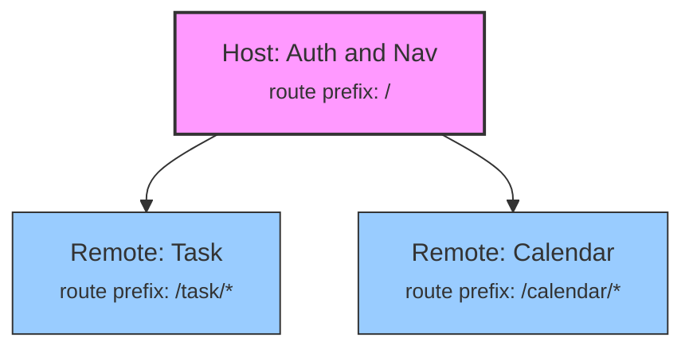

# Micro frontend poc

This repository illustrates an opiniated micro frontend solution relying on Web Components.

## How to start?

```shell
# Install dependencies (installs dependencies across the workspace)
yarn install
# only the first time and anytime you update shared
cd shared
yarn build
# Then, start dev
yarn dev
```

## Concept and context

Micro frontends were first mentioned in [ThoughtWorks Technology Radar in 2016](https://www.thoughtworks.com/radar/techniques/micro-frontends).
The idea is - like microservice architecture - the following:

    In this approach, a web application is broken up by its pages and features, with each feature being owned end-to-end by a single team.

The context here is more to build a proof of concept of already decoupled frontend apps. They are so decoupled that they’re hosted on distinct domain names. This is great in terms of isolation, but now that we want to introduce a transverse navigation, we’re not able to create a great user navigation experience as each time we navigate between apps we have to entirely reboot them :sob:.

## Vocabulary

- **Microfrontend**: An architectural style where a web application is composed of smaller, independently deployable frontends (microfrontends). Each microfrontend is often developed by a different team, allowing for more flexibility, modularity, and scalability.
- **Host**: The primary application in a microfrontend setup, often responsible for handling global features like authentication, navigation, and layout. The host app provides a framework for integrating multiple microfrontends (remote apps) and manages shared state or communication between them
- **Remote**: An independently developed microfrontend application integrated into the host app. Remote apps are often isolated and encapsulated, with minimal dependencies on the host, and they focus on specific features or pages
- **Routing**: The mechanism that directs users to the correct microfrontend based on the URL. In a microfrontend architecture, routing can be complex because different microfrontends may need to handle different routes or paths.
- **Isolation**: The practice of ensuring that each microfrontend operates independently, without unwanted interference from other microfrontends. This involves isolating dependencies, styles, and state management to prevent conflicts.
- **Communication Channel**: Mechanisms, such as custom events or global state management libraries, that enable microfrontends to communicate with each other while maintaining loose coupling. Common approaches include using a global event bus, Redux, or Context API.

## Goal

1. The user should feel the app as it was only a single frontend application, even if Task and Calendar are maintained by distinct teams and can be deployed independently, in perfect isolation.
1. The user should have very nice transitions when he switches between remote apps.
1. The user should feel instant loading when he switch between remote apps



## Technology we want to rely on

Most of them are web standards:

- **[Web Components](https://developer.mozilla.org/en-US/docs/Web/API/Web_components)**: with (almost) perfect isolation thanks to Shadow DOM and [ShadowRoot](https://developer.mozilla.org/en-US/docs/Web/API/ShadowRoot).
- **Host routing**: [react router](https://reactrouter.com/en/main) and [View Transitions API](https://developer.mozilla.org/en-US/docs/Web/API/View_Transitions_API).
- **[Speculation Rules API](https://developer.mozilla.org/en-US/docs/Web/API/Speculation_Rules_API)**: for prerender and prefetch, based on powerfull url matching rules.
- **[Manifest](https://developer.mozilla.org/en-US/docs/Mozilla/Add-ons/WebExtensions/manifest.json)**: to dynamically "discover" and know how to boot each remote, even if published assets of each remote are hashed and change on each deployment.

## Why Web Components?

| Pros                                                                                                                                                                 | Cons                                                                                                                                                                                                        |
| -------------------------------------------------------------------------------------------------------------------------------------------------------------------- | ----------------------------------------------------------------------------------------------------------------------------------------------------------------------------------------------------------- |
| - **Encapsulation**: Web Components allow you to encapsulate HTML, CSS, and JavaScript. Using the Shadow DOM, styles and DOM are isolated from the rest of the page. | - **Performance considerations**: this is the counterpart, as remotes share nothing so be careful of keeping remote as lightweight as possible.                                                             |
| - **Standardized Technology**: Being part of the web standards, web components are natively supported by modern browsers.                                            | - **State Management**: Managing state across multiple web components can be cumbersome without a centralized state management system. Inter host<->remote communication should be kept simple and adapted. |
| - **Framework Agnostic**: They can be integrated into projects using React, Angular, Vue, or no framework at all.                                                    | - **Styling Challenges**: Shadow DOM encapsulation can make applying global styles or themes more difficult and being studied with precautions.                                                             |
| - **Independent Dependencies**: Each micro frontend bundles its own dependencies, allowing the use of incompatible versions of libraries like React.                 | - **Testing Complexity**: Shadow DOM will need some adaptations in the QA/test tooling.                                                                                                                     |

## Why not module federation?

2 vite based module federation solutions have been tested and rejected.
Tests have been made with distinct versions of react and react-router:

- [@originjs/vite-plugin-federation](https://github.com/originjs/vite-plugin-federation): too many issues [like this one](https://github.com/originjs/vite-plugin-federation/issues/534) with conflicting shared dependencies and poor isolation.
- [@module-federation/vite](https://github.com/module-federation/vite): same thing, [even with browser crashes](https://github.com/module-federation/vite/issues/179).
